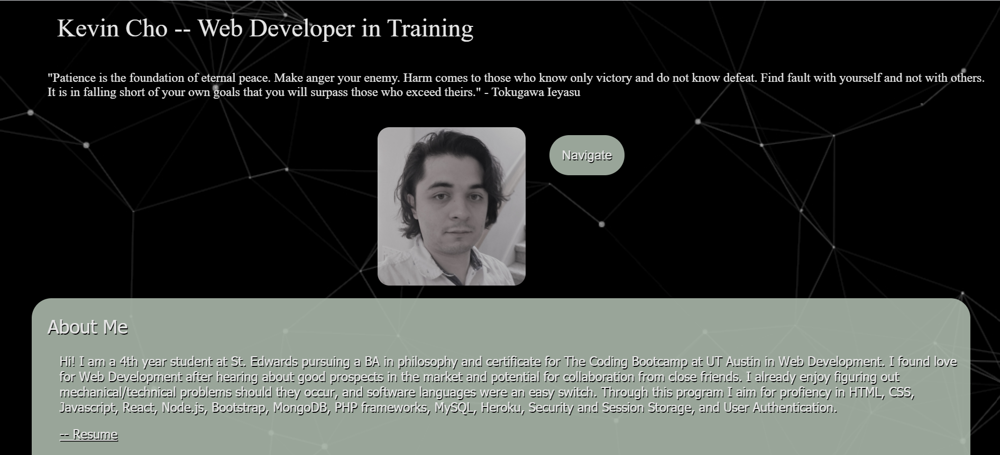

# CSS-Portfolio
This is a deployed portfolio of my future work samples and a brief introduction to me. I built a basic website for showing who I am, my Resume, social media, placeholders for software projects, a contact page, and a self-portrait. I plan on updating the projects section in the future.

# Languages Used
CSS
HTML

# Link
kccho2254.github.io
https://github.com/kccho2254/kccho2254.github.io

# Credits
## [Formspree](https://formspree.io/)

Formspree is a free web API for contact forms of various kinds!
## [w3schools](https://www.w3schools.com/html/html_forms.asp)

The structure for the contact form came from this website

## [Mozilla Developer](https://developer.mozilla.org/en-US/)

Is really helpful for understanding flex

## [README Guide](https://github.com/adam-p/markdown-here/wiki/Markdown-Cheatsheet#lines)

Helpful website for learning Markdown syntax

# Contributing
Feel free to reach out or request pulls from github. My classmates and class instructor Calvin are also to thank for helping me learn.

# License
© Kevin C Cho

Licensed under The Unlicense